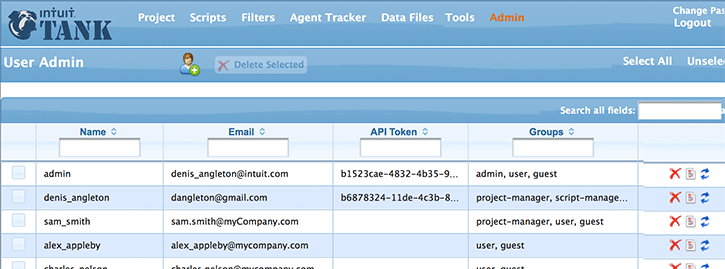
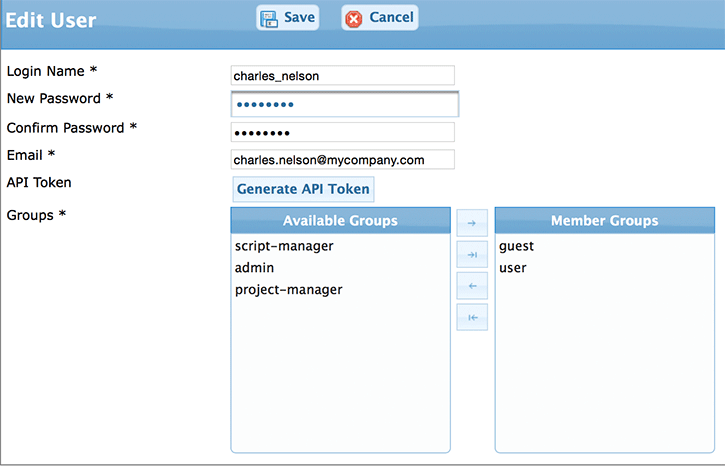
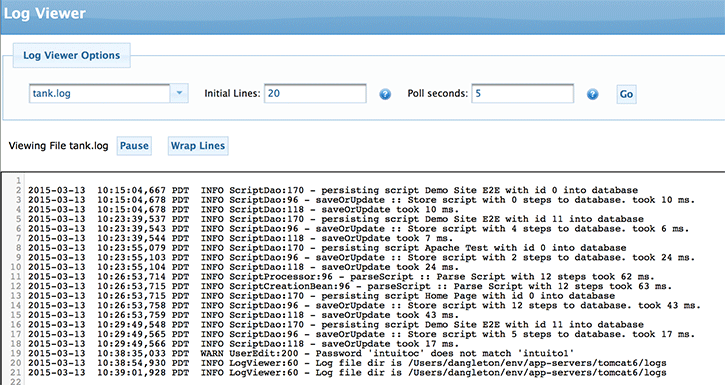

# Administration
If you have administrator rights, you will see the `Admin` link at the top of the page. The `Admin` section allows you to view log files, administer users, and set log levels.

## User Management

As discussed in the `Users and Groups` section, Tank users have specific roles that dictate which actions they're allowed to perform on which entities. Users may have multiple roles, and any user may edit any entity which they own.

<figure markdown>
  { width="600" }
  <figcaption>User Management</figcaption>
</figure>

### Assigning Roles

To assign a role to a user, navigate to the `Admin` section and follow the link to `Administer Users`. Once you've selected a user to administer, change their roles by moving the desired options from the `Available Groups` column to the `Member Groups` column. When finished, click the `Save` button.

<figure markdown>
  { width="600" }
  <figcaption>Assigning Roles</figcaption>
</figure>

# Log Viewer
The log viewer alows you to see the server logs. It works like the tail Linux command.  

<figure markdown>
  { width="600" }
  <figcaption>Log Viewer</figcaption>
</figure>

