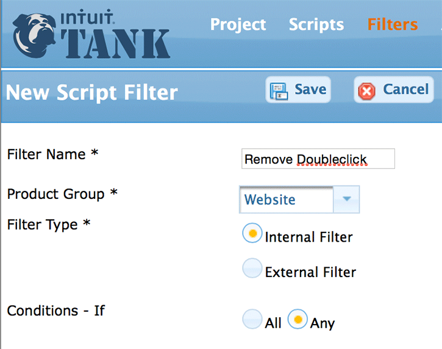
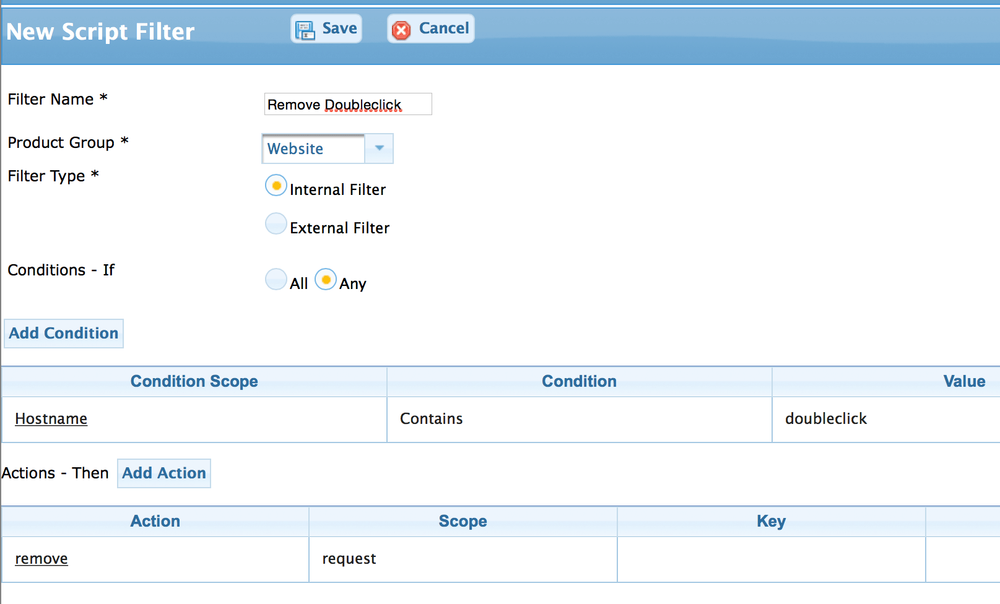
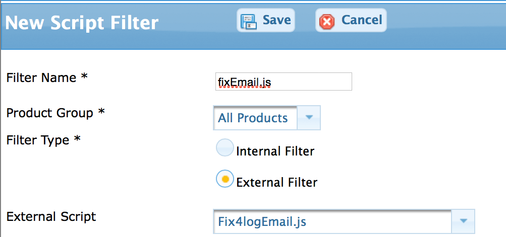
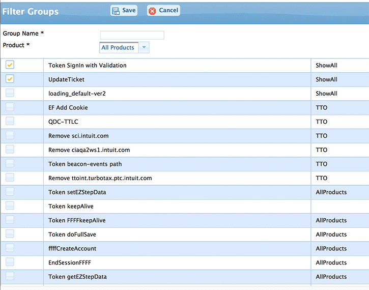

# Filters and Filter Groups

`Filters` are enhancements made to a `pre-recorded` script, which allow the script to behave more like a real user. Filters enable the script to be more dynamic, where it can behave a certain way when certain conditions are met.  
Filters can add `functions`, `thinktime`, and change script behavior, etc.   

`Filter Groups` are created to contain multiple filters that are unique to that group. For e.g,  A `TTO Production` Filter group will have only filters that are unique to that type of user.   

When uploading a script, you will be given the option to choose the filters and groups you want to process the script with.   
Selecting a group will select all the filters associated with that group automatically by default. You may choose to remove those that are not required. 

<figure markdown>
{ width="600"}
<figcaption>Filters and Filter Groups</figcaption>
</figure> 

### Creating a Filter

1. Click on the `New Filter` icon to open the `New Script Filter` form.
            <figure markdown>
            { width="600"}
            <figcaption>Adding a New Filter</figcaption>
            </figure> 

2. A filter can be `internal` or `external` (`Javascript`). Select the type on the radio button and the form will change depending on the mode.
            <figure markdown>
            { width="600"}
            <figcaption>Select the Type</figcaption>
            </figure> 

    - `Internal Filters`
        - Internal filters consist of one of more Conditions and one or more Actions . Conditions determine if this filter matches a particular request and Actions define the transformation to apply when the conditions match.
        - Set the `Name`, `Product` and whether the conditions are `match all` or `match any`. 
        - Click on `Add Condition` and `Add Action` and set the properties appropriately.
            <figure markdown>
            { width="600"}
            <figcaption>Internal Filters</figcaption>
            </figure> 
    
    - `External Filters`
        - External filters consist of a reference to an external javascript file.
        - Set the Name, Product and Script.
            <figure markdown>
            { width="600"}
            <figcaption>External Filters</figcaption>
            </figure> 

### Creating a Filter Group
1. Click on the `New Filter Group` icon to open the `Filter Group` selection form.
2. Give the Filter Group a unique `name`, select the `Product`, and select from the list of `filters` that belong to that group.

    <figure markdown>
            { width="600"}
            <figcaption>Create a Filter Group</figcaption>
    </figure> 

