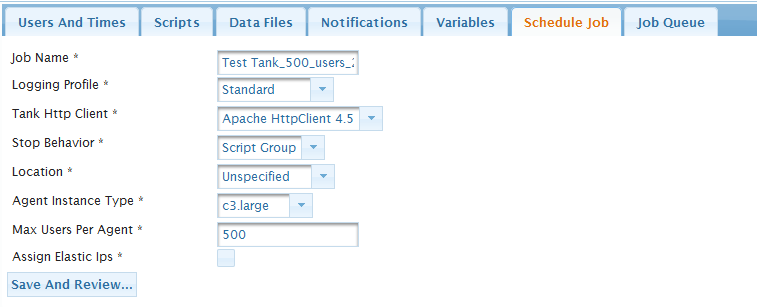

# Projects

Projects define how tests are executed.  

### Creating a Project 
#### Configuring Top-level Properties
The main properties that must be specified include:  

* `Number of Users` - The Number of test users.
* `Ramp time` - The Ramp time.
* `Test length` - The test length.
* `Scripts` - Which scripts to use.
* `Data Read` - Whether to read from data.

#### Steps to creation
Clicking the `Project` tab takes the user to the main screen, which lists all the previously created projects. From this screen, the user can click the `New Project` icon or edit an existing project by clicking the name in the list.  
<figure markdown>
  { width="700" }
  <figcaption>Projects Home</figcaption>
</figure>

1. After clicking the `New Project` icon, the user will be presented with a screen where they can name the project.
2.  Select the `Product` this test belongs to and optionally add comments.
3. After clicking `Save` in the toolbar, the project will be created and you will be taken to the `Edit project` screen.  

<figure markdown>
  { width="700" }
  <figcaption>Create a New Project</figcaption>
</figure>

### Editing a Project 
You can click on the `Edit` icon at the far right of the project row or click the name of the Project to edit a project. From the edit screens, you can set the properties of the project as well as run a test.  

#### Configuring Top-level Properties
The main properties that must be specified include:  

<figure markdown>
  { width="700" }
  <figcaption>Configure Edit Properties</figcaption>
</figure>

* `Name` - The name of the Project. This must be unique.
* `Simulation Time` - This is the length of the test and should be filled in if the `Simulation Time Reached` option is chosen under the `Users and Times` tab. If `Scripts Loops Completed` is chosen on the `Users and Times` tab , this field can be ignored.
* `Ramp Time` - This is how quickly test users should be added. For example, if the total number of Users is 3000, the Ramp Time is 15 minutes, and the User Increment is 1, then 3.33 users will be added every second.
* `Owner` - The owner of this Project. Owners and Adminstrators have specific rights to Projects within Intuit Tank. See Security for more information.
* `Total Users` - This is a `read-only` reference field that will total the users for all the regions configured on the `Users And Times` tab. 

#### Configuring Additional Properties
There are additional properties that be configured for a Project. Expand the section below explore further.  
??? abstract "Additional Project Properties"

    === "Users and Times "
        
        `Users and Times` is the tab within a Project where you configure the number of users that will be simulated in your test and how the load will be generated and terminated.  
        <figure markdown>
          { width="700" }
          <figcaption>Users and Times</figcaption>
        </figure>

        * `Users` - Enter the number of users for each Amazon EC2 region to simulate. Regions are the Amazon data center locations. Available regions are configured by the administrator.
        * `Run Scripts Until` - Simulation Time Reached - Run scripts until simulation time has been reached. Will run trough the script once in its entirety regardless of the simulation time ant then continur running the last script group until the simulation time has been reached.
        Scripts Loops Completed - Run the script once then terminate the user.

        * `Workload Type` - Increasing - Users will be added for the length of time specified in the Ramp Time field, after which the test will run at steady state with the number of Total Users until Simulation Time or Script Loops are completed.
        Steady State - Start all the users at once.

        * `Initial Users` - The number of users to simulate immediately when the test starts. The typical value is 0.
        * `User Increment` - The number of users to add at a time during the Ramp Time. The typical value is 1.         
        
        

    === "Scripts and Test Plans"

        The `Scripts` tab is where the the flow of the test is configured. Some key terminology to review here would be: 

        * `Tests and Test Plans` - Tests are a collection of `Test Plans`. A Test Plan consists of one or more `Script Groups`. Test Plans run a percentage of the users for the test.
        * `Script Groups` - Script Groups contain one or more Scripts. Script groups are intended to be self contained flows for a user to execute.They are the demarkation unit for stopping a test as well as for looping after a test has met the simulation time.
        * `Scripts` - Scripts are a collection of steps to run. Looping can be configured at either level.

        === "Adding a Test Plan"
            1. Click on `Add Test Plan` to add a Test Plan to the project.
            2. Fill in the name and the percentage of users this plan will run. You are responsible for making sure that the percentages add up to 100%.
            3. Click the `Add` button to save the Test Plan. The new Test Plan will show up as a new tab in the `Test Groups` tab view.
              <figure markdown>
                { width="700" }
                <figcaption>Add a Test Plan</figcaption>
              </figure>
        === "Adding a Script Group"
            1. Click on `Insert Script Group` to add a Script Group at the end of the list or the `Insert` icon at the far right of any existing Script Group to add one before the one selected.
            2. Fill in the name and number of loops.
            3. Click the `Add` button to save the Script Group.
              <figure markdown>
                { width="700" }
                <figcaption>Insert a Script Group</figcaption>
              </figure>
        === "Editing a Script Group"
            1. Click on name of Script Group or the `Edit` icon at the far right of any existing Script Group.
            2. Move scripts from the available box to the selected box by using either the buttons or by dragging the scripts form one to the other. _(Refer to the `Move Script Groups` figure below)_
            3. You can reorder the Selected Scripts by dragging them up or down in the list. Click the `Add Scripts` button to add the scripts to the script group (lower panel on the `Move Script Groups` figure). 
            4. You may set the number of loops of the individual script by clicking the `loop number` and changing the value.
            3. When you are done, Close the `Edit Script Group` Dialog.
            !!! info "Pro Tip"
                A user can specify multiple Script Groups and Scripts within each Group. This gives the user a great deal of control over how their test is run.  
                For example, `Script Group 1` might be looped twice and contain `Script1` (looped once) and `Script2` (looped twice).  
                Running the test would result in this sequence: `Script1, Script2, Script2, Script1, Script2, Script2`

              <figure markdown>
                { width="700" }
                <figcaption>Insert a Script Group</figcaption>
              </figure>
              <figure markdown>
                { width="500" }
                <figcaption>Move Script Groups</figcaption>
              </figure>

    === "Data Files"
        Data Files are `csv` files that can be accessed by the scripts.   
        Each of the lines in a csv file will get divided evenly among the agents. So if there are 6000 lines in the csv file and there are two agents running (600 users) each agent will get 3000 lines.   
        When individual user threads access the csv file, the lines are locked as they get doled out so that lines are only given out once.  
        Use the `Upload Data Files` button to upload Data Files.   
        Move Data Files from the available to the selected panels using either the buttons or by dragging.  
        You can view the contents of a Data File by clicking on the `magnifying glass` :material-magnify-scan: icon.  
        <figure markdown>
           { width="600" }
           <figcaption>Upload Data Files</figcaption>
        </figure>

    === "Variables" 
        A Project can be configured with `Global variables`.   
        
        !!! info "Pro Tip"
            * You can either allow these variables to be overridden by the scripts (or) to be immutable (default).  
            * You can cause the agent to use a Proxy Server for requests by setting a variable named `TANK_HTTP_PROXY` in the format `proxyHost:proxyport`. e.g. `myProxyserver:80`

        Use the `Add Variable` button and fill in the key and the value.  
        Check the `Allow Scripts to Override Project Variables` checkbox to allow scripts to override the variable values.   
        <figure markdown>
           { width="600" }
           <figcaption>Add Variable</figcaption>
        </figure>

    === "Job scheduling"
        When you schedule a job, you snapshot it off at that point so that you can then run it exactly as it is set up at the time. A pop up will show the details of the job you are going to run.  
        ### Configuring Scheduling Properties

            * `Name` - The name of the job.
            * `Logging Profile` - How verbose the agent logs should be.
            * `Tank HTTP Client` - The client implementation you want to use to drive load.
            * `Stop Behavior` - Where you want the script to exit when stop command is issued.
            * `Location` - Where the test is running. Configured by the administrator.
            * `Agent Instance Type` - The instance type for the agent.
            * `Max Users per Agent` - The number of users each agent should run.
            * `Assign Elastic IPs` - Whether the agents should use an elastic ip that you have reserved. If no ips are available, then the agent will not get an Elastic IP.        
        
        <figure markdown>
           { width="600" }
           <figcaption>Schedule Job</figcaption>
        </figure>

        After you schedule a job you will automatically be taken to the `Job Queue` tab.  
        !!! warning "Note"
            It is important that you examine the details of the job, to make sure that everything is as you want it.
        
        <figure markdown>
           { width="500" }
           <figcaption>Add Job to queue</figcaption>
        </figure>    

    === "Job queue"  
        The Job Queue show all the jobs tht have been scheduled (or) have run. It allows you to control the execution of the test and monitor the current state of the test.  
        <figure markdown>
           { width="600" }
           <figcaption>Job queue</figcaption>
        </figure>    
        

        