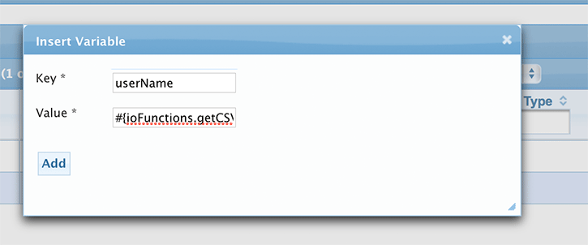

# Scripts

!!! note "Tip"
    Scripts are accessed from the `Scripts` Top navigation link.

A Tank performance script is a preset of steps that `virtual`(mocked for load) users will execute during a load test.   
A `step` can be composed from one of the following step types:  

- [x] HTTP Request
- [x] Think Time
- [x] Sleep Time
- [x] Variable
- [x] Clear Session
- [x] Logic

### Importing a recorded Script
There are two ways to generate a script.
 
* Importing from a `Tank-Proxy recording`. 
* Manually creating a script. 

This section will mainly focus on the `Importing` method.    

!!! warning "Note"
    Currently Tank only supports Intuit Tank's own `Proxy Recording` tool. More info on the Recording tool is covered in the later sections.

#### Steps to Importing a Script
1. Click on the `New Script` icon which takes you to the `Create Script` form.
2. Fill in the `Script Name` and select from the appropriate `Product name`.
3. Click on the `Browse` button to select the recording file or the `zip archive` that contains the recording file. _(If Creating a blank script just select the `Blank Script` radio button and skip this step.)_  
4. Select the appropriate `Filter Groups` (AND/OR) individual `Filters`. The Filters are used to transform the imported recording to a final  Tank script. _(Refer to the `Filters` section for more details on `Filters` and `Filters Group`.)_
5. Click on the `Save` button. Once the Intuit Tank script is created, you will be taken back to the `Scripts` section and your script will appear at the top of the list.  

    <figure markdown>
        { width="600" }
        <figcaption>Add a New Script</figcaption>
    </figure> 

    <figure markdown>
        { width="600" }
        <figcaption>Create Script</figcaption>
    </figure> 

!!! warning "Warning"
    If uploading a zipped recording, Tank will only extract the first one from the zip, in case there are more than one recordings in the uploaded zip.  


### Modifying a Script
Click on the name of the script (or) the `Edit` icon corresponding to the script you wish to edit. This will take you to the `Edit Script` form.  
  
The attributes that can be edited include:

* `Name` - The name of the script. This is an `in-place` editor. Simply click the name once to enter the `Edit` mode.
* `Product` - The name of the product this script belongs to.
* `Owner` - The user who owns the script.
* `Comments` - Comments are accessed by the `Comments` button on the toolbar.   

!!! error "TODO: Edit verbiage for comments heading"

#### Step Selection
Selection of script steps is modelled different than other sections.  
  
Instead of check boxes, it uses a standard selection method, and highlights to indicate selection.   
    <figure markdown>
        { width="600"}
        <figcaption>Modify Script</figcaption>
    </figure> 

This toolbar has actions for inserting, deleting, and changing the order of the steps.   

### Re-ordering Execution steps of a Script
Below are the instructions to re-order the Script steps.  

1. To re-order/move a step you will need to click on the button labeled `Reorder Steps` . A pop-up window labeled `Reorder Steps` will appear.
2. Use the buttons to move steps up or down in the list. You can also drag the steps to the new order.
3. Click on the `Save` button to save the new ordering.

    <figure markdown>
        { width="500"}
        <figcaption>Reorder Script steps</figcaption>
    </figure> 

!!! warning "Warning"
    The script is not saved to the database until you click `Save` in the main toolbar. Changes can be discarded at any time by clicking `Cancel` or by navigating to another panel. In general, it is recommended that you periodically save your updates.
 
### Variables
Variables are used to store various values that can be used to parameterize requests (i.e. `hostnames`, `query string`, `POST data`, etc.).   
You can define a variable to be set to a `literal` value or `function`.   
A variable can also be set by parsing the `response` or `headers` of a given request. When using variables in requests, you need to add the `@` symbol in front of the variable. This tells Tank to replace the variable with the actual value.

#### Adding a Variable
To add a Variable, 

1. Click on the button labeled `Variable` . The Variable dialog will pop up.
2. In the `Key` field you will define your variable name.
3. The `Value` field is where you define the actual value or `function` you use will associate with the variable.
4. Click on the `Add` or `Save` button when done.

    <figure markdown>
        { width="500"}
        <figcaption>Adding a Variable</figcaption>
    </figure> 


!!! info "Note"
    You can cause the agent to use a `Proxy Server` for requests by setting a variable named `TANK_HTTP_PROXY` in the format `proxyHost:proxyport`. e.g. `myProxyserver:80`


### Think Time and Sleep Time
`Think Time` is used to simulate a real user's page to page transitions in an application. In Tank, a random think time is generated based on the `min` and `max` values provided.   
`Sleep time` is used when you wish to wait for a specific amount of time.

!!! info "Note"
    Think Time and Sleep Time are entered in `milliseconds`.

#### Adding Think Time and Sleep Time

1. To add a `Think Time` or `Sleep Time`, click on the appropriate button or the link to edit an existing one. The `Insert or Edit` dialog will pop up.
2. In the `Key` field you will define your variable name.
3. For `Think Time` you will need to enter the `Minimum` and `Maximum` time in `miliseconds`. For `Sleep Time` you just need to enter a single value.
4. Click on the `Add` or `Save` button when done.


    <figure markdown>
        { width="600"}
        <figcaption>Adding Think Time and Sleep Time</figcaption>
    </figure> 

### HTTP Request
In Tank, a request is either a `HTTP(S)` `GET` or `POST` request. Before we go through the steps of adding a new request, we will go over what makes up the basic request.   

First, will start with the fields that can make up a request:

* `Host` - You can enter either the `FQDN`, `IP address` or variable for the hostname. When you use a variable, you need to add the `&` symbol at the beginning of the variable. (e.g. `@webserver`) You can specify the port by appending a `:[port]` to the host. e.g. `server.domain.com:9001`
* `Protocol` - Supported protocols `HTTP` or `HTTPS`.
* `Path` - The path to the requested resource. The path can also be parameterized with variables. For e.g, `#{rootContext}/ajax/logEmail`
* `Method` - Supported methods are `GET` or `POST`
* `Query String` - The query parameters expressed as key value pairs that get appended to the `url`.
* `POST data` - Parameters expressed as key value pairs that get posted in the `body` of the request.
* `Group` - Allows you to group requests under a `label`. Grouping is used with `On Failure` field below. _`Note`: This field is optional._
* `Logging` - This field is used to gather response times on a specific request. _`Note`: This field is `optional`._
* `On Failure` - Defines what action to take next when a response validation has failed.   
    
    The following are the 5 actions that can be taken by the tool when validation has failed: 

    * `Abort Script, goto next Script (Default)` – The virtual user will skip to the next script defined in the project. If there is only one script, the virtual user will start from over from the top of the script. 
    * `Continue to next request` – Execute next request. 
    * `Skip remaining requests in a group` – Will execute the next step after the last request with the group label.
    * `Goto Group` – Jumps to the first step with the group label.
    * `Terminate user` – The virtual user is terminated.  

* `Name` - Allows a user to uniquely label a request. (i.e. `Login request`, `Signout request` or `Print request`). _`Note`: This field is optional._

#### Adding a HTTP Request
 
 To add a HTTP request, 

1. Click on the appropriate button or the link to edit an existing one. The `Insert` or `Edit` dialog will pop up.
2. Fill in the appropriate top level attributes such as `Host`, `Path`, `Name`, etc.
3. For each of the tabs, you can add or modify the key value pairs.

    <figure markdown>
        { width="600"}
        <figcaption>Adding a HTTP Request</figcaption>
    </figure> 

!!! info "Note"
    * Key and Value are in-place edit components. click on them to change their value and click the check mark to accept the change or the 'X' to revert.
    * Not all Heders are re-played. The following are filtered out: 
        - Host
        - Cookie
        - Connection
        - If-None-Match
        - If-Modified-Since
        - Content* (Content-Type, Content-Length)


#### Supplemental Properties
The following Supplemental properties can be added to the HTTP Request.

* `Response Header` - Response Headers are read only. They are here to help you in creating validation or assignemnts.
* `Request Cookies` - Cookies lets you see which cookies were set when the request was made. However, only cookies that are set from variables are replayed.
* `Response Cookies` -  Response Cookies are read only.
* `Query String` - Used primarily with `GET` requests.
* `Post Data` - Only valid for POST requests.
* `Validation` - Perform validation specified. If validation fails, the On Fail action is performed. Key is the xpath or expression for the value.
* `Assignments` - Assign values to variables for use in other script steps. Key is the variable name and value is the xpath or expression for the value.

!!! info "Note"
    Two Synthetic headers can be validated as well:

        - `HTTPRESPONSEMESSAGE` - The http response message. e.g. `OK` or `Not Found`
        - `HTTPRESPONSECODE` - The http response code. e.g. `200` or `404`

Finally, Click on the `Save` button when done.


### Clear Session
Inserting this step clears the session, which can be thought of as comparable to closing and re-opening the browser.   

This accomplishes the following:

- Clears cookies
- Clears the cache

### Logic
Inserting this step allows the user to use `Javascript` to control the flow of the script, change variable values, or perform any custom logic that is too complex for the normal operations.

Logic step scripts are written in `Javascript`. They have access to the following objects:

* `Variables` - The current variables in the test plan execution.
* `Request` - The previous request in the test plan execution.
* `Response` - The previous response in the test plan execution.

!!! info "Note"
    There are functions that are added to each script for accessing these values.

Control flow is controlled by setting the `action` output parameter in the `ioBean`. Handled values are:

* `goto:[groupName]` - Jump to a group within the script with the specified name.
* `restartPlan` - Restart the test plan from the start.
* `abortScriptGroup` - Aborts the current script group and proceeds to the next script group.
* `abortScript` - Aborts the current script and proceeds to the next script.
* `abortGroup` - Aborts the current group within a script and proceeds to the next request after the current group.
* `terminateUser` - Terminates the current user.

!!! info "Tip"
    There are functions that are added to each script for accessing these values.

The following functions are added to each script before it is run and are available for use.

??? abstract "Functions added at each Script"

    === "Logging functions"
        ``` js
            /**
            * prints the line to the output. will be log
            * 
            * @param line
            *            the line to print
            */
            function logWithDate(line) {
                ioBean.println(new Date().toString + ": " + line);
            }

            /**
            * prints the line in info context.
            * 
            * @param line
            *            the line to print
            */
            function log(line) {
                ioBean.println(line);
            }
            /**
            * prints the line in error context.
            * 
            * @param line
            *            the line to print
            */
            function error(line) {
                ioBean.error(line);
            }

            /**
            * prints the line in debug context. Will be logged to console or test but not
            * to logs when in production.
            * 
            * @param line
            *            the line to print
            */
            function debug(line) {
                ioBean.debug(line);
            }            
        ```
    === "Data Transformational functions"
        ``` js
            function toJsonObj(text) {
               try {
                    return JSON.parse(text);
                } catch(e) {
                    error("Error parsing json: " + e);
                }
                return text;
            }
            function toJsonString(jsonObj) {
                try {
                    return JSON.stringify(jsonObj, null, '\t');
                    } catch(e) {
                    error("Error converting json to string json: " + e);
                    }
                    return jsonObj;
                }
        ```        
    === "Data Retrieval functions"
        ``` js 
        /**
        * gets the com.intuit.tank.http.BaseRequest object of the last call made.
        * 
        * @return the request or null if no requests have been made
        */
        function getRequest() {
            return ioBean.getInput("request");
        }

        /**
        * gets the com.intuit.tank.http.BaseResponse object of the last call made.
        * 
        * @return the response or null if no requests have been made
        * 
        */
        function getResponse() {
            return ioBean.getInput("response");
        }

        /**
        * gets the request body as string if not binary
        * 
        * @return the body or empty string if null or binary
        */
        function getResquestBody() {
            if (getRequest() != null) {
                return getRequest().getBody();
            }
            return "";
        }

        /**
        * gets the response body as string if not binary
        * 
        * @return the body or empty string if null or binary
        */
        function getResponseBody() {
            if (getResponse() != null) {
            return getResponse().getBody();
            }
            return "";
        }

        /**
        * Returns the value of the variable or null if variable does not exist
        * 
        * @param key
        *            the variable name
        * @returns the variable value.
        */
        function getVariable(key) {
            return ioBean.getInput("variables").getVariable(key);
        }

        /**
        * Sets the value of the variable.
        * 
        * @param key
        *            the variable name to set
        * @param value
        *            the value to set it to
        */
        function setVariable(key, value) {
            ioBean.getInput("variables").addVariable(key, value);
        }
        ```   
    === "Result functions"
        ```js
            /**
            * jump to a group within the script with the specified name.
            * 
            * @param groupName
            *            the name of the group to go to. if the group does not exist, it
            *            skips to next script.
            */
            function gotoGroup(groupName) {
                setAction("goto " + groupName);
            }

            /**
            * restart the TestPlan from the start.
            */
            function restartPlan() {
                setAction("restartPlan");
            }

            /**
            * aborts the current ScriptGroup and proceeds to the next.
            * 
            * @returns
            */
            function abortScriptGroup() {
                setAction("abortScriptGroup");
            }

            /**
            * aborts the current Script and proceeds to the next.
            */
            function abortScript() {
                setAction("abortScript");
            }

            /**
            * aborts the current group and proceeds to the next request after the current
            * group.
            */
            function abortGroup() {
                setAction("abortGroup");
            }

            /**
            * terminates this user.
            */
            function terminateUser() {
                setAction("terminateUser");
            }

            /**
            * sets the action in the output.
            */
            function setAction(action) {
                ioBean.setOutput("action", action);
            }

        ```    


